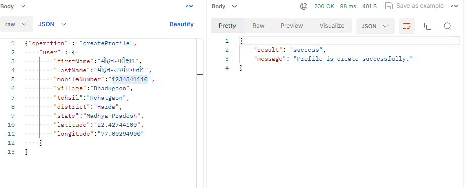

# k2_krishikutumb

A K2_Krishikutumb is an agriculture mobile application 

<h2>Technologies Used 👨🏽‍💻:</h2>
Python 
Django 
PostgreSql Database 
Django restframework api 
FCM(Notification service) 
AWS S3Bucket (images,vedios,files) 

<h2>Tool's Used 👨🏽‍💻:</h2>
vscode (Local system) 
PGadmin4(Local system) 
Postman 
AWS EC2 server 
Ubuntu server 
WinSCP  
Putty  
### Screenshots:

  
  
  
  

